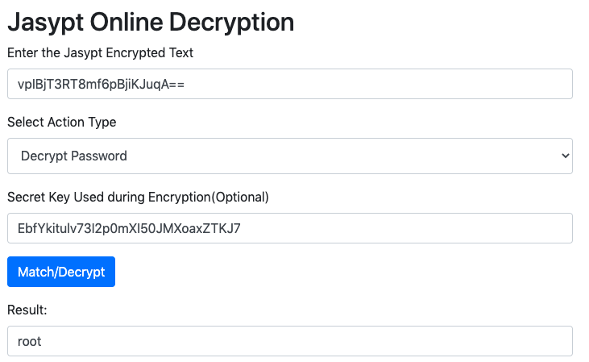

# spring-ENC | sprint encode (plan text) get enc password

## 0x00简介


Jasypt代表Java简化加密，它提供纯文本，数字和二进制文件的基本加密以保护机密数据，它是完全线程安全的，并且在多处理器中也提供高性能。

Jasypt提供了更简单的加密和解密文本的方法，并且不需要任何深入的加密知识即可开始使用它，简单地，输入要加密的纯文本，Jasypt将完成其余的计算并为您这种加密是单向加密，它还提供了两种加密机制。

在实施双向加密时，除了提供纯文本之外，您还需要提供秘密文本，并且该秘密文本可用于解密加密的文本。

默认情况下，Jasypt使用PBEWithMD5AndDES加密算法，但它也提供选择其他更强加密选项的选项，例如PBEWithMD5AndTripleDES


## application.yml

```
spring: 
  application:
    name: argus
    version: 2.0
  data:
    elasticsearch: #ElasticsearchProperties
      cluster-name: idss-es #默认即为elasticsearch
  datasource:
    url: jdbc:mysql://x.x.x.x:3306/test?autoReconnect=true&useUnicode=true&characterEncoding=utf-8&allowMultiQueries=true
    driver-class-name: com.mysql.jdbc.Driver
    username: ENC(vpIBjT3RT8mf6pBjiKJuqA==) root
    password: ENC(xxxxxxxxxxxxx==) 
    
# User, Password encryptor salt
jasypt:
  encryptor:
    password: EbfYkitulv73I2p0mXI50JMXoaxZTKJ7
```

## how to decode get plan text?

下面免费的Jasypt在线加密和解密工具提供了一种方法以及两种（简单）加密和解密选项，还提供了比较纯文本和Jasypt加密密码的选项。


```
    username: ENC(vpIBjT3RT8mf6pBjiKJuqA==)
    
    # User, Password encryptor salt
    password: EbfYkitulv73I2p0mXI50JMXoaxZTKJ7

```

#### online decode for spring enc

https://www.devglan.com/online-tools/jasypt-online-encryption-decryption




`username: ENC(vpIBjT3RT8mf6pBjiKJuqA==)` to `username: root`
